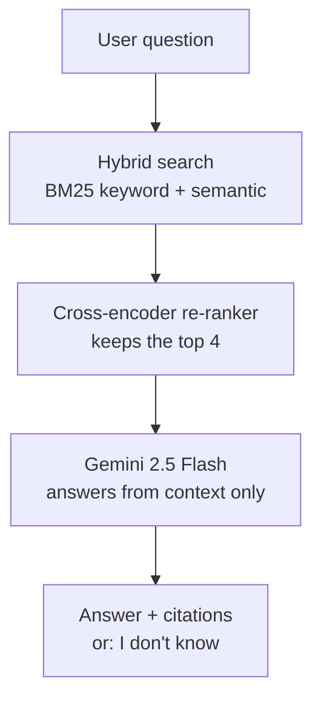

# Vela Cloud — Internal Knowledge-Base Assistant (RAG)

A retrieval-augmented question-answering system over a company's internal documents,
built to production patterns: hybrid search, cross-encoder re-ranking, source-cited
answers, a web UI and API, and — the part most portfolios skip — a measured evaluation
of both retrieval and answer quality.

> Repo: `ask-vela-rag-assistant`. **Vela Cloud is a fictional company**; all 109 documents
> in `data/docs/` are synthetic, written for this project. No real company data is used.

---

## What it does

Employees ask plain-English questions ("How much vacation do staff in Germany get?",
"What does error `OKTA-403` mean?") and get an answer drawn **only** from the company's
documents, with citations — or an honest "I don't know" when the documents don't cover it.



The pipeline uses three models, each for the job it is best at: a small embedder to narrow
109 documents to a shortlist, a slower but precise cross-encoder to pick the best few, and
a chat model to write the final answer. Retrieval runs locally and free; only the final
answer calls the Gemini API.

---

## Headline result

The project doesn't just *use* hybrid search and re-ranking — it **measures whether they
help**, on a hard evaluation set of 27 paraphrased, synonym-heavy, and loose-code queries
(the way real users actually ask). The metric is **MRR** (how close to the top of the
results the correct document lands; 1.0 = always first).

With a small, free, **local** embedder, each retrieval upgrade improves the score:

| Strategy | Hit@4 | MRR |
|---|---|---|
| Dense (semantic only) | 0.704 | 0.611 |
| Hybrid (BM25 + dense) | 0.852 | 0.719 |
| **Hybrid + re-ranker** | **0.963** | **0.861** |

Re-ranking lifted MRR by **+41%** and Hit@4 by **+37%**.

Running the same test with a **state-of-the-art** embedder (`gemini-embedding-001`) told a
more interesting story:

| Embedder | Dense MRR | Hybrid MRR | Re-rank MRR |
|---|---|---|---|
| `gemini-embedding-001` (SOTA, paid) | **0.944** | 0.873 | 0.861 |
| `all-MiniLM-L6-v2` (small, free, local) | 0.611 | 0.719 | **0.861** |

**Two takeaways this surfaced:**

1. **Hybrid search and re-ranking are not universally beneficial.** They rescue a weak or
   generic embedder; they add little (and can slightly hurt) on a SOTA embedder over a small,
   clean corpus. The right move is to measure, not assume.
2. **The re-ranker converges to the same quality (MRR ≈ 0.86) from both directions.** A free,
   offline embedder plus hybrid search and re-ranking reaches essentially the same retrieval
   quality as the paid SOTA embedding API — a real cost and privacy result for production.

Full analysis: [`eval/results-summary.md`](eval/results-summary.md).

---

## Evaluation

Most RAG demos stop at "it answers questions." This project measures it on two axes.

**Retrieval quality** (`src/evaluate.py`) — against a labeled `question → correct-document`
set, reports Hit@k, MRR, precision, and recall. Runs fully offline. Results above.

**Answer quality** (`src/judge.py`) — an LLM-as-judge grades each written answer for
*faithfulness* (no claims beyond the retrieved documents) and *relevancy* (does it answer
the question), plus an *abstention* check (does it correctly refuse when the documents lack
the answer):

| Metric | Score |
|---|---|
| Faithfulness (no hallucination) | 1.00 |
| Relevancy (answers the question) | 1.00 |
| Abstention accuracy | 3 / 3 |

Caveat (stated plainly): this is a small, clean, synthetic set graded by the same model
family — a strong signal, not a production guarantee. A natural next step is a larger noisy
set, a different judge model to avoid self-grading bias, and human spot-checks.

The labeled question sets live in `eval/`, including a deliberately hard set with synonyms
("Deutschland", "Britain", "maternity") and loose error codes.

---

## Tech stack

- **Orchestration:** LangChain (core + text-splitters), with hybrid fusion and re-ranking
  implemented directly (Reciprocal Rank Fusion + cross-encoder) rather than via framework
  wrappers, for resilience to version churn.
- **Generation:** Google Gemini 2.5 Flash.
- **Embeddings:** swappable — `gemini-embedding-001` (API) or `all-MiniLM-L6-v2` (local).
- **Keyword search:** BM25 (`rank-bm25`) with a custom tokenizer so loose codes ("STR 418")
  match documents storing them as `STR-418`.
- **Re-ranker:** `cross-encoder/ms-marco-MiniLM-L-6-v2` (local, no API).
- **Vector store:** Chroma (local, persistent).
- **Serving:** FastAPI + a single-page web UI; container-ready via the included `Dockerfile`.

---

## Project structure

```
src/
  config.py      # env, model names, retrieval knobs
  loader.py      # load + chunk markdown (no API; unit-testable)
  embeddings.py  # picks Gemini or local embeddings
  ingest.py      # embed chunks -> Chroma (throttled for free tier)
  retriever.py   # dense / hybrid / hybrid+rerank strategies
  rag.py         # retrieve -> prompt -> cited answer
  ask.py         # terminal entrypoint
  evaluate.py    # retrieval metrics (Hit@k, MRR, P/R)
  judge.py       # answer-quality (LLM-as-judge)
  api.py         # FastAPI service + web UI + request logging
  static/        # the chat web page
data/docs/       # 109 synthetic documents, 8 categories
eval/            # labeled question sets + results
Dockerfile       # optional containerized run
```

---

## Quickstart

```bash
python -m venv .venv
source .venv/bin/activate          # Windows: .venv\Scripts\activate
pip install -r requirements.txt
cp .env.example .env               # add a Gemini key (free: aistudio.google.com/app/apikey)

python -m src.ingest               # build the index
```

**Command line:**
```bash
python -m src.ask "How much vacation do staff in Germany get?"
```

**Web app** (chat UI + API):
```bash
uvicorn src.api:app --reload
```
Then open **http://127.0.0.1:8000** for the chat interface, or `/docs` for the API.

**Reproduce the retrieval comparison** (offline, no API key needed):
```bash
python -m src.evaluate dense-hard   --mode dense   --set hard
python -m src.evaluate hybrid-hard  --mode hybrid  --set hard
python -m src.evaluate rerank-hard  --mode rerank  --set hard
```

Switch the embedder with `EMBEDDING_PROVIDER=gemini|local` in `.env` (re-run ingest after).

---

## Engineering notes

- **Embedder and retrieval strategy are independent dials** — `EMBEDDING_PROVIDER`
  (which model embeds) and `RETRIEVAL_MODE` (dense/hybrid/rerank). The cross-embedder
  comparison came from sweeping both.
- **Free-tier aware** — ingestion batches and throttles to respect Gemini's free-tier
  rate limits; embeddings and re-ranking can run entirely offline to avoid them.
- **Honest "I don't know"** — the prompt constrains answers to retrieved context, and the
  abstention set tests this directly rather than assuming it works.
- **Observability** — every API request logs latency and the documents used to
  `logs/requests.jsonl`.

---

*Built as a learning project to practice production RAG patterns end to end:
ingestion, hybrid retrieval, re-ranking, a served web app, and measurable evaluation.*